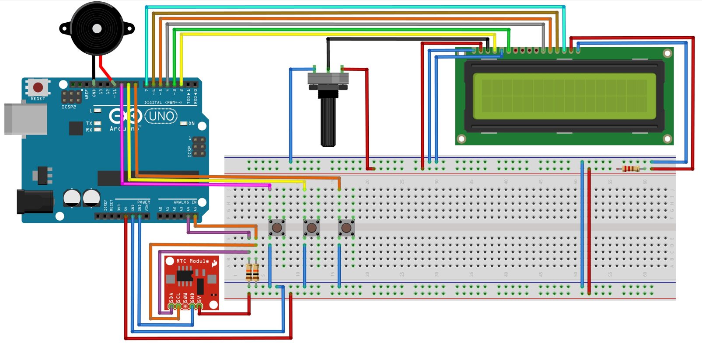

28/07/2021

# Giới thiệu
Đồng hồ báo thức là một thiết bị quan trọng trong việc thông báo, hẹn giờ, thời gian nấu nướng, …

Project dưới đây mô tả cách sử dụng, code,… Bấm nút 1 (trái) để đặt giờ báo thức, bấm nút 2 (giữa) để tăng giá trị của giờ, phút, bấm nút 3 (phải) để chuyển tiếp từ giờ sang phút hoặc để set báo thức hoặc là để tắt báo thức

# Yêu cầu phần cứng
•	Arduino

•	LCD

•	DS1307

•	Biến trở 10k ôm

•	2 điện trở 10k ôm, 1 điện trở 220 ôm

•	3 nút bấm

•	1 chuông (gọi là buzzer)

•	Dây nối

•	Bảng mạch dài/ ngắn

# Mạch (Vẽ bằng phần mềm Fritzing)


Để có thể nối mạch, 

Nối chân SCL và SDA của ds1307 lần lượt vào A5 và A4 (có thể nối thông qua điện trở 10k ôm như trong hình do ds1307 bản tiny có vấn đề về đọc thông tin khi cắm trực tiếp SCL SDA vào A5 A4), chân 5V và GND nối vào các vị trí bình thường. 

Nối đầu dương của chuông vào DIGITAL 11, đầu âm nối vào GND. 

3 nút bấm nối lần lượt vào digital 10, 9, 8 và đầu còn lại nối vào GND

Nối các chân LCD như sau: chân VSS nối vào GND, VDD nối vào 5V, V0 nối vào chân giữa biến trở xoay (2 chân bên cạnh của biến trở xoay nối vào GND và 5V), RS nối vào chân 2, RW nối vào GND, E nối với chân 3, D4 D5 D6 D7 lần lượt nốt với chân 4 5 6 7, A nối với điện trở 220 ôm rồi nối vào 5V, K nối với GND

# Code
Trước tiên phải setTime cho con DS1307 như sau:
```
#include <Wire.h>
#include <LiquidCrystal_I2C.h>
#include "RTClib.h"

RTC_DS1307 rtc;
char daysOfTheWeek[7][12] = {"Sun", "Mon", "Tue", "Wed", "Thu", "Fri", "Sat"};

void setup ()
{
 Serial.begin(9600);
 if (! rtc.begin())
 {
   Serial.print("Couldn't find RTC");
   while (1);
 }

  if (! rtc.isrunning())
 {
   Serial.print("RTC is NOT running!");
   Serial.println();
 }
   rtc.adjust(DateTime(F(__DATE__), F(__TIME__)));
   //rtc.adjust(DateTime(2014, 1, 21, 3, 0, 0));
}

void loop ()
{
   DateTime now = rtc.now();
   if(now.hour()<=9)
   {
     Serial.print("0");
     Serial.print(now.hour());
   }
   else {
    Serial.print(now.hour());
   }
   Serial.print(':');
   if(now.minute()<=9)
   {
     Serial.print("0");
     Serial.print(now.minute());
   }
   else {
    Serial.print(now.minute());
   }
   Serial.print(':');
   if(now.second()<=9)
   {
     Serial.print("0");
     Serial.print(now.second());
   }
   else {
    Serial.print(now.second());
   }
   Serial.println();

   Serial.print(daysOfTheWeek[now.dayOfTheWeek()]);
   Serial.print(",");
   if(now.day()<=9)
   {
     Serial.print("0");
     Serial.print(now.day());
   }
   else {
    Serial.print(now.day());
   }
   Serial.print('/');
   if(now.month()<=9)
   {
     Serial.print("0");
     Serial.print(now.month());
   }
   else {
    Serial.print(now.month());
   }
   Serial.print('/');
   if(now.year()<=9)
   {
     Serial.print("0");
     Serial.print(now.year());
   }
   else {
    Serial.print(now.year());
   } 
   Serial.println();
   delay(1000);
}

```
Sau đó chạy file ```run.ino```

---
### Chi tiết có trong file project.docx (có code)
---

# Video test:
```
https://drive.google.com/file/d/1OStGOzRf52qThcOtZ_QncaLYNadeg3h2/view?usp=sharing
```

Bonus: Phát nhạc cướp biển caribe (cái buzzer kia bị thiếu miếng che nên tui dùng tạm giấy nhớ :))
```
https://drive.google.com/file/d/1Slwo3Yv5l4KFpzu6UUbngRPYP3HIPOag/view?usp=sharing
```
